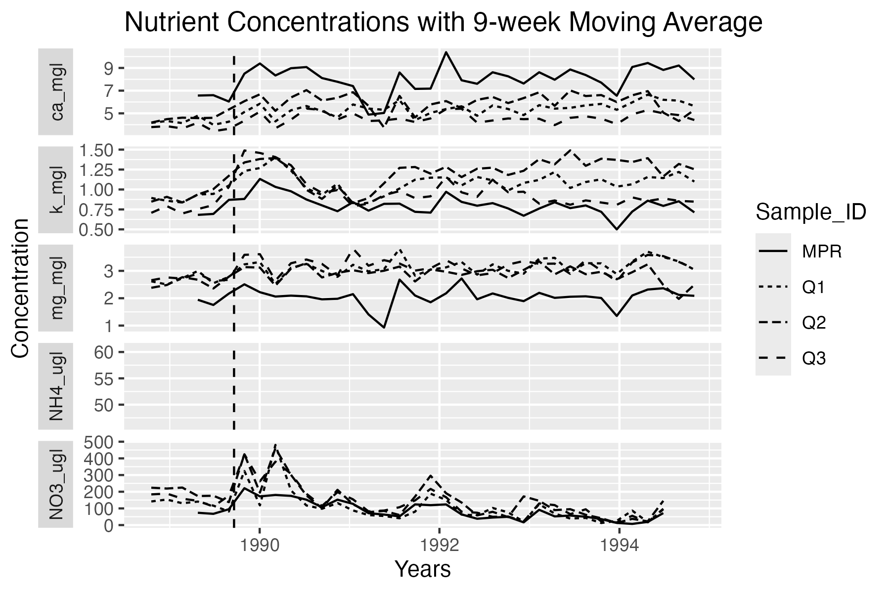

# Time Series of Hurricane Hugo's Effect on Stream Water Concentrations

Author: [Karolina Sienko](https://github.com/karolinasienko)

Contributors: [Max Czapanskiy](https://github.com/FlukeAndFeather) & [Ale Vida Meza](https://github.com/avidalmeza)

## Background
This repository contains all of the data and code used to analyze the effects of Hurricane Hugo's disturbance on stream water concentrations of potassium, nitrate, magnesium, calcium, and ammonium, in Puente Roto Mameyes (PRM) and Bisley Quebradas 1, 2 and 3 (BQ1, BQ2, BQ3). The purpose is to reproduce Figure 3 from a paper done by Schaefer, Douglas. A. et al. titled *Effects of hurricane disturbance on stream water concentrations and fluxes in eight tropical forest watersheds of the Luquillo Experimental Forest, Puerto Rico* [(2000)](https://doi.org/10.1017/s0266467400001358).


## Data
The following data files for this analysis were downloaded from [EDI Data Portal](https://portal.edirepository.org/nis/mapbrowse?packageid=knb-lter-luq.20.4923064) and can be found in the folder `1_raw_data`:

- QuebradaCuenca1-Bisley.csv
- QuebradaCuenca2-Bisley.csv
- QuebradaCuenca3-Bisley.csv
- RioMameyesPuenteRoto.csv

Each .csv file was read in and filtered to the date range from October 18th, 1988 to December 31st, 1994. The relevant columns corresponding to Sample ID, Sample Date, and concentrations for K, NO$_3$, Mg, Ca, and NH$_4$ were also selected.


```{r}
#| output: false
library(tidyverse)
library(lubridate)
```

```{r}
#| output: false

source("../R/moving-average.R")

# Reading in each dataset
bq1_data <- read_csv("../1_raw_data/QuebradaCuenca1-Bisley.csv")
bq2_data <- read_csv("../1_raw_data/QuebradaCuenca2-Bisley.csv")
bq3_data <- read_csv("../1_raw_data/QuebradaCuenca3-Bisley.csv")
PRM_data <- read_csv("../1_raw_data/RioMameyesPuenteRoto.csv")


# Extracting relevant columns (date, concentrations, etc.)
relevant_bq1 <- bq1_data |>
  filter(Sample_Date >= "1988-10-18" & Sample_Date <= "1994-12-31") |>
  select(Sample_ID, Sample_Date, K, `NO3-N`, Mg, Ca, `NH4-N`)

relevant_bq2 <- bq2_data |>
  filter(Sample_Date >= "1988-10-18" & Sample_Date <= "1994-12-31") |>
  select(Sample_ID, Sample_Date, K, `NO3-N`, Mg, Ca, `NH4-N`)

relevant_bq3 <- bq3_data |>
  filter(Sample_Date >= "1988-10-18" & Sample_Date <= "1994-12-31") |>
  select(Sample_ID, Sample_Date, K, `NO3-N`, Mg, Ca, `NH4-N`)

relevant_PRM <- PRM_data |>
  filter(Sample_Date >= "1988-10-18" & Sample_Date <= "1994-12-31") |>
  select(Sample_ID, Sample_Date, K, `NO3-N`, Mg, Ca, `NH4-N`)
```


## Methods
The concentrations for each of the five nutrients in each of the four watersheds were averaged using a 9-week moving window. These were all combined into one data frame which was pivoted longer, and they were then graphed to replicate Figure 3 from Schaefer et al. [(2000)](https://doi.org/10.1017/s0266467400001358).

```{r}
#| output: false


# Calling the moving_average function to get the tibble of average conc. for all watersheds
bq1_smoothed <- moving_average(relevant_bq1)
bq2_smoothed <- moving_average(relevant_bq2)
bq3_smoothed <- moving_average(relevant_bq3)
PRM_smoothed <- moving_average(relevant_PRM)


# Combining all smoothed tables
combined_table <- rbind(bq1_smoothed, bq2_smoothed, bq3_smoothed, PRM_smoothed)


# Manipulating the data frame
combined_table_long <- combined_table |>
  pivot_longer(
    cols = "k_mgl":"NH4_ugl",
    names_to = "Nutrient",
    values_to = "Concentration"
  )


# Graphing each watershed's concentrations
combined_table_long |>
  ggplot(
    aes(
      x = window_start,
      y = Concentration,
      linetype = Sample_ID
    )
  ) +
  geom_line() +
  theme(
    strip.placement = "outside"
  ) +
  geom_vline(
    xintercept = date("1989-09-19"),
    linetype = "dashed"
  ) +
  labs(
    title = "Nutrient Concentrations with 9-week Moving Average",
    y = "Concentration",
    x = "Years"
  ) +
  facet_grid(Nutrient ~ ., scales = "free", switch = "y")

```

## Results
{width=800}


## References

McDowell, William H., and USDA Forest Service. International Institute Of Tropical Forestry (IITF). 2024. “Chemistry of Stream Water from the Luquillo Mountains.” [Environmental Data Initiative](https://doi.org/10.6073/PASTA/F31349BEBDC304F758718F4798D25458).

Schaefer, Douglas. A., William H. McDowell, Fredrick N. Scatena, and Clyde E. Asbury. 2000. “Effects of Hurricane Disturbance on Stream Water Concentrations and Fluxes in Eight Tropical Forest Watersheds of the Luquillo Experimental Forest, Puerto Rico.” [Journal of Tropical Ecology 16 (2): 189–207](https://doi.org/10.1017/s0266467400001358).

